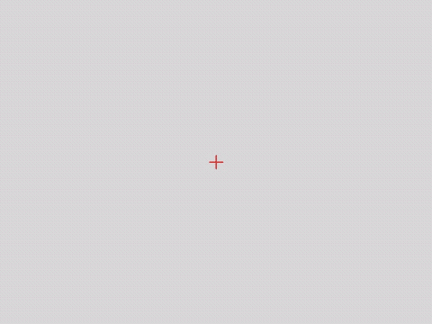

# PX4 Autonomy Lab

Hands-on lab for UAV autonomy on the [PX4](https://px4.io) flight stack: SITL simulation
with Gazebo (running in Docker), MAVLink/MAVSDK ground-side scripting in Python, offboard
control, and — as the capstone — **vision-based precision landing on an ArUco marker**
(the "drone-in-a-box" use case).



*The capstone demo: OpenCV tracks the pad marker from the downward camera while an
Offboard velocity controller flies the descent — touchdown **2–3 cm** from center.
Full write-up in [docs/M5_PRECISION_LANDING.md](docs/M5_PRECISION_LANDING.md).*

> Everything here runs in simulation and is fully reproducible: no drone hardware required.

## Goals

- Learn the PX4 flight stack from zero: flight modes, arming/failsafe logic, EKF, parameters.
- Build practical MAVLink/MAVSDK skills: telemetry, missions, offboard setpoints.
- Combine edge computer vision (OpenCV) with flight control for precision landing.

## Architecture

```
┌─────────────────────────┐        UDP 14550        ┌──────────────────┐
│  Docker container       │ ──────────────────────► │  QGroundControl  │
│  PX4 SITL + Gazebo      │                         │  (host)          │
│  (gz_x500 quadrotor)    │        UDP 14540        ├──────────────────┤
│                         │ ──────────────────────► │  Python/MAVSDK   │
└─────────────────────────┘                         │  scripts (host)  │
                                                    └──────────────────┘
```

## Milestones

| # | Milestone | Status |
|---|-----------|--------|
| M1 | Telemetry logger (MAVSDK → CSV) | ✅ done |
| M2 | Arm / takeoff / hold / land with error handling | ✅ done |
| M3 | Waypoint mission + failsafe testing (battery low, datalink loss) | ✅ done |
| M4 | Offboard control: velocity-setpoint square & circle | ✅ done |
| M5 | **Precision landing on ArUco marker** (OpenCV + offboard descent) | ✅ done |
| M6 | M2 ported to MAVSDK C++ | ✅ done |
| M7 | **GPU perception (Isaac ROS)**: AprilTag landing in a photoreal world | ✅ demo 1 done |

## M7 — GPU-accelerated precision landing (Isaac ROS)


*Left: chase view in the baylands world. Right: onboard camera. The AprilTag is
detected on the RTX GPU by `isaac_ros_apriltag` (CUDA/NITROS) from the camera
bridged out of Gazebo via ros_gz; a MAVSDK controller with full-quaternion
attitude compensation flies the descent. Touchdown **3–10 cm** from pad center.
Full video: [m7_apriltag_landing.mp4](docs/media/m7_apriltag_landing.mp4).*

## Repository layout

```
scripts/   Python milestone scripts (MAVSDK)
cpp/       C++ milestones (MAVSDK C++)
docs/      SETUP.md (environment), NOTES.md (PX4 concepts study notes)
tests/     pytest suites
```

## Reproducing

See [docs/SETUP.md](docs/SETUP.md) for the full environment setup
(Docker, PX4 SITL container, QGroundControl, Python venv).

## License

MIT — see [LICENSE](LICENSE).
